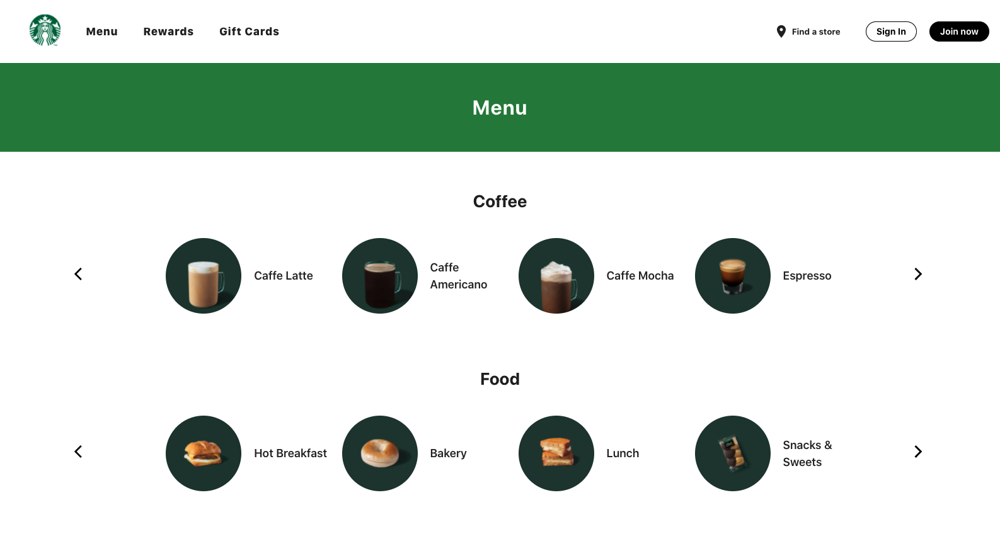

# Enterprise Spartans Team Project (Starbucks)

## Team members: 

    Miguel Gonzalez 
    Jiaxiang Guo
    Shubham Patel
    

## Project Description 

## Online Store

Our Starbucks implementation consists of a React front-end which is connected through REST API to the H2 and MySQL databases. The front end design consists of a navigation header, the body based on different screens, and the footer. 
  

As we can see, we have a landing home with a beautiful front-end which can be updated to the latest deals and promotions. The header navigation routes between pages and sign in, sign buttons are in-place for authentication. 
  

Take a look at our menu!
  

  

The menu screen provides with a list of items that are clickable, and currently fetches the row of Coffees from the possibles in our Starbucks Order's model. In the bottom of the page we can see a footer that can route to other pages. Unfortunately, rewards and gift card screens were not fully implemented. 

### Online Store Architecture Diagram

The connections between services and renders is in place, but not fully implemented. While developing the front-end all the button functions were missing to be integrated. However, the API connection to the database allows us to perform requests through coded functions —— we would just be missing the integration of this functions to the right UI components. 