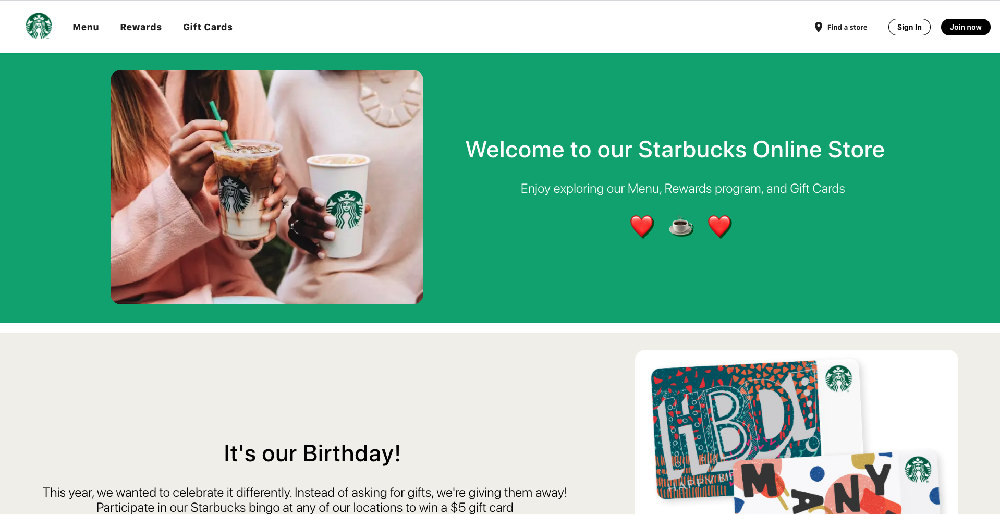

# Enterprise Spartans Team Project Journal (Starbucks)

## Team members: 

    Miguel Gonzalez 
    Jiaxiang Guo
    Shubham Patel
    

## Project Description 

Enterprise Spartans team has been selected to bid on work for the next version of Starbucks's Online Store and Back office Apps.  The team at Starbucks has been busy prototyping our requirements where you can see our work on a back end REST API, a sample in-store Cashier's App and a Mobile App Prototype. 

<br>

## Requirements

### Online Store

Our Starbucks implementation consists of a React front-end which is connected through REST API to the H2 and MySQL databases. The front end design consists of a navigation header, the body based on different screens, and the footer. 
<br><br/>



As we can see, we have a landing home with a beautiful front-end which can be updated to the latest deals and promotions. The header navigation routes between pages and sign in, sign buttons are in-place for authentication. 
<br><br/>

Take a look at our menu!
<br><br/>


<br><br/>

The menu screen provides with a list of items that are clickable, and currently fetches the row of Coffees from the possibles in our Starbucks Order's model. In the bottom of the page we can see a footer that can route to other pages. Unfortunately, rewards and gift card screens were not fully implemented. 

### Online Store Architecture Diagram


The connections between services and renders is in place, but not fully implemented. While developing the front-end all the button functions were missing to be integrated. However, the API connection to the database allows us to perform requests through coded functions —— we would just be missing the integration of this functions to the right UI components. 

### To Run:

From our source project directory:

- To initialize back end
     cd backend/REST\ API/  && gradle bootRun


- To start front end
    cd online-store && yarn start


### Cashier's App 

The Cashiers App will be used by our Baristas at each retail store front.  Orders will taken directly from the customer and entered into the Cashier,  Customer then can pay "touch less" via their phones.  Our current prototype automatically generates an Order. Drinks can be customized from the menu. Upon successful payment, an order confirmation number will be generated with a short order summary. 

The payment processing is done through CyberSource and thymeleaf is used to generate the list of drinks. The processed order is successfully store to MySQL database which can later be used to track issuses. 


Take a look at our cashier's homepage


<br>

### To Run:

From our starbucks-cashiers project directory:

Create a MySQL Database

* Run on Docker

This connects to MySQL as root and allows access to the user from all hosts. 

```
docker run -d --name mysql -td -p 3306:3306 -e MYSQL_ROOT_PASSWORD=cmpe172 mysql:8.0
```

* Docker command to access MySQL Container:

```
docker exec -it mysql bash
mysql --password
```

- Then do a gradle bootRun
- Navigate to http://localhost:8080/ to start the app 

<br>

### API Testing 


