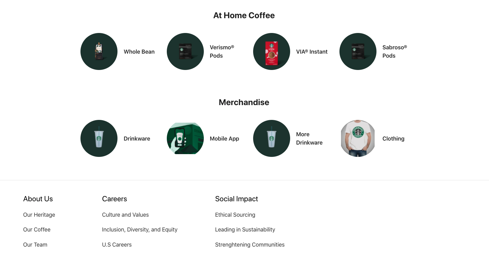

# Enterprise Spartans Team Project (Starbucks)

## Team members and tasks done: 

    Miguel Gonzalez 
    Jiaxiang Guo
    Shubham Patel
    

## Project Description 
  

## Online Store

  
Our Starbucks implementation consists of a React front-end which is connected through REST API to the H2 and MySQL databases. The front end design consists of a navigation header, the body based on different screens, and the footer. 
  

As we can see, we have a landing home with a beautiful front-end which can be updated to the latest deals and promotions. The header navigation routes between pages and sign in, sign buttons are in-place for authentication. 
  

Take a look at our menu!
  

  

### Online Store Architecture Diagram

