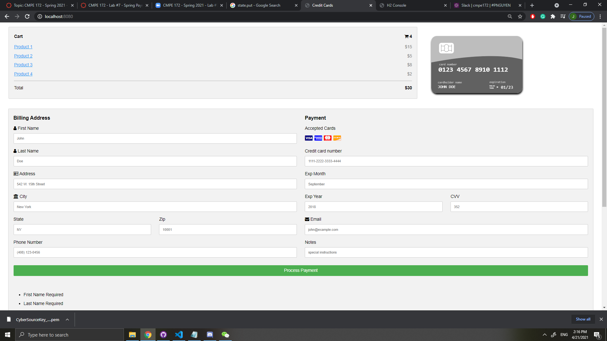
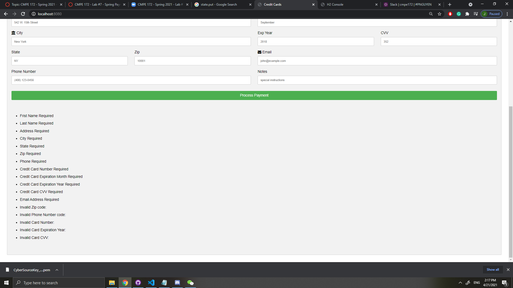
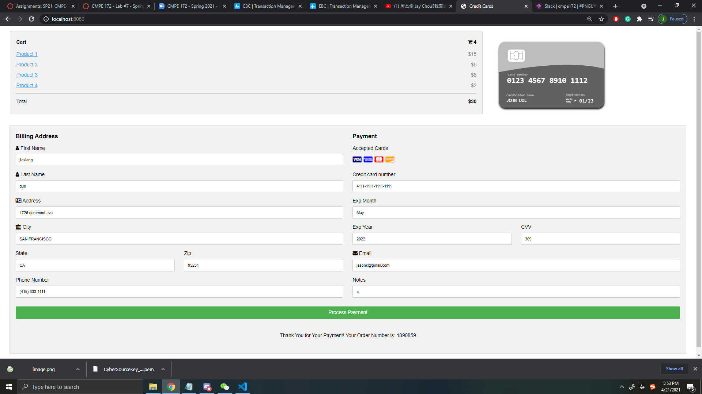
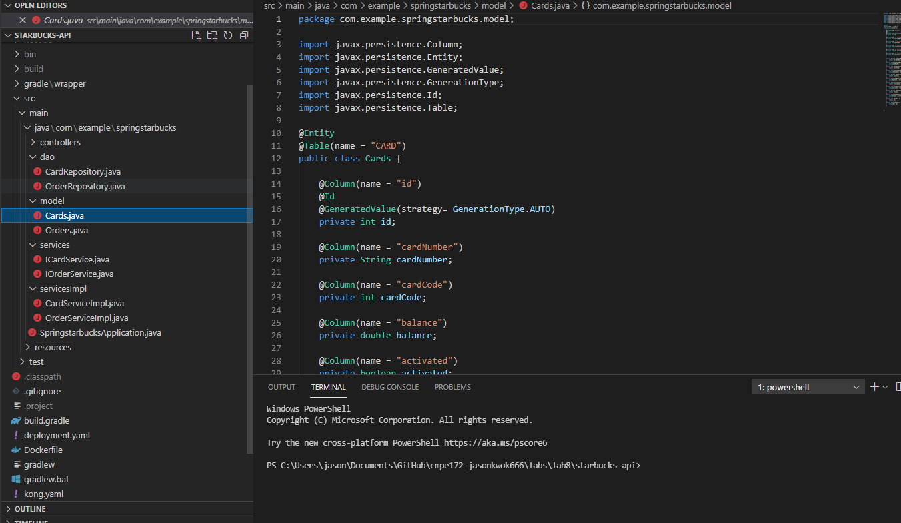

Week 1:  

Payment Page Output with validation form checking

  
It is succesfully process the payment.

  
This is the detail of the payment transation on CyberSource.

  
This payment api is finished and ready to be applied

Code to control the validation form.
        Pattern pattern = Pattern.compile("\\d{3}");
        Matcher matcher = pattern.matcher(command.getcvv());
        Pattern pattern1 = Pattern.compile("\\d{5}");
        Matcher matcher1 = pattern1.matcher(command.getZip());
        Pattern pattern2 = Pattern.compile("\\d{4}-\\d{4}-\\d{4}-\\d{4}");
        Matcher matcher2 = pattern2.matcher(command.getcardnumber());
        Pattern pattern3 = Pattern.compile("[(]\\d{3}[)] \\d{3}-\\d{4}");
        Matcher matcher3 = pattern3.matcher(command.getphonenumber());
        Pattern pattern4 = Pattern.compile("\\d{4}");
        Matcher matcher4= pattern4.matcher(command.getexpyear());
        
        /* Render View 
        model.addAttribute( "message", "Thank you for your payment" ) ;

        if (!matcher.matches()) {
            model.addAttribute( "message", "Validation Errors, Please Resubmit." ) ;
            System.out.println("The CVV number is invalid");
            return "creditcards";
        }
        if (!matcher1.matches()) {
            model.addAttribute( "message", "Validation Errors, Please Resubmit." ) ;
            System.out.println("The Zip code is invalid");
            return "creditcards";
        }
        if (!matcher2.matches()) {
            model.addAttribute( "message", "Validation Errors, Please Resubmit." ) ;
            System.out.println("The Card Number is invalid");
            return "creditcards";
        }
        if (!matcher3.matches()) {
            model.addAttribute( "message", "Validation Errors, Please Resubmit." ) ;
            System.out.println("The Phone Number is invalid");
            return "creditcards";
        }
        if (!matcher4.matches()) {
            model.addAttribute( "message", "Validation Errors, Please Resubmit." ) ;
            System.out.println("The Expiration Year is invalid");
            return "creditcards";
        }
        */
        
 Week 2:  
 In this week, I didn't write too many code because I focused on studying how to connect the backend and forntend using MySQL and Spring framework. Mnay research has been done. and ready to implement code next week after finishing lab8 and lab9.
 
   
 Udated code for validationform
    
         boolean hasErrors = false;
        if( command.firstname().equals("") )  { hasErrors = true ; msgs.add("Frist Name Required");}
        if( command.lastname().equals("") )   { hasErrors = true ; msgs.add("Last Name Required");}
        if( command.address().equals("") )    { hasErrors = true ; msgs.add("Address Required");}
        if( command.city().equals("") )       { hasErrors = true ; msgs.add("City Required");}
        if( command.state().equals("") )      { hasErrors = true ; msgs.add("State Required");}
        if( command.zip().equals("") )        { hasErrors = true ; msgs.add("Zip Required");}
        if( command.phone().equals("") )      { hasErrors = true ; msgs.add("Phone Required");}
        if( command.cardnum().equals("") )    { hasErrors = true ; msgs.add("Credit Card Number Required");}
        if( command.expmon().equals("") )     { hasErrors = true ; msgs.add("Credit Card Expiration Month Required");}
        if( command.expyear().equals("") )    { hasErrors = true ; msgs.add("Credit Card Expiration Year Required");}
        if( command.cvv().equals("") )        { hasErrors = true ; msgs.add("Credit Card CVV Required");}
        if( command.email().equals("") )      { hasErrors = true ; msgs.add("Email Address Required");}

        if( !command.zip().matches("\\d{5}") )                               { hasErrors = true ; msgs.add("Invalid Zip code: "+ command.zip());}
        if( !command.phone().matches("[(]\\d{3}[)] \\d{3}-\\d{4}") )         { hasErrors = true ; msgs.add("Invalid Phone Number code: "+ command.phone());}
        if( !command.cardnum().matches("\\d{4}-\\d{4}-\\d{4}-\\d{4}") )      { hasErrors = true ; msgs.add("Invalid Card Number: "+ command.cardnum());}
        if( !command.expyear().matches("\\d{4}") )                           { hasErrors = true ; msgs.add("Invalid Card Expiration Year: "+ command.expyear());}
        if( !command.cvv().matches("\\d{3}") )                               { hasErrors = true ; msgs.add("Invalid Card CVV: "+ command.cvv());}

        if ( months.get( command.expmon()) == null ) { hasErrors = true ; msgs.add("Invalid Card Expiration Month:" + command.expmon());}

        if ( states.get( command.state()) == null ) { hasErrors = true ; msgs.add("Invalid State:" + command.state());}

        if(hasErrors) {
           msgs.print();
           model.addAttribute( "messages", msgs.getMessages());
           return "creditcards";
        }
 
 
 WEEK 3：
  - Implemented and deployed the Card API to project.

  - Implemented and deployed the Order API to project. 
  
  - Creating Mysql Database to connect the project
      
  
  
  This image shows card and order api is done.
      
  WEEK 4：
    
  - waiting for group members to finish front-end page for cashier app

  - implemented and updated Card and Order API.
  
  - creating deploying file tfor the project to deploy on google cloud
 
 Code to update Card and Order api:  
 
 	//get all the starbuck cards api
	@RequestMapping(value="/getcards", method=RequestMethod.GET)
	@ResponseBody
	public List<Cards> getAllStarBucksCards() {
		return cardServiceImpl.getAllStarbucksCards();
	}

	//Submit the starbuck card api
	@RequestMapping(value="/newcard", method=RequestMethod.POST)
	@ResponseBody
	public String createStarbucksCard(Cards cards) {
		return cardServiceImpl.postStarbucksCard(cards);
	}

	//find the starbucks card api 
	@RequestMapping(value="/findcard", method = RequestMethod.GET)
	@ResponseBody
	public Cards findStarbucksCard(@RequestParam("cardnumber") String cardNumber) {
		System.out.println(cardNumber);
		return cardServiceImpl.getSpecificStarbucksCard(cardNumber);
	}

	//Activate starbuck card api
	@RequestMapping(value="/card/activate", method=RequestMethod.POST)
	@ResponseBody
	public String activateStarbucksCard(@RequestParam("cardnumber") String cardNumber, @RequestParam("code") int code) {
		return cardServiceImpl.activateStarbucksCardTrue(cardNumber, code);
	}

	//delete all the starbucks records
	@RequestMapping(value="/cards", method = RequestMethod.DELETE)
	@ResponseBody
	public void deleteAllCards(){
		cardServiceImpl.deleteStarbucksCards();
	}

  
 

