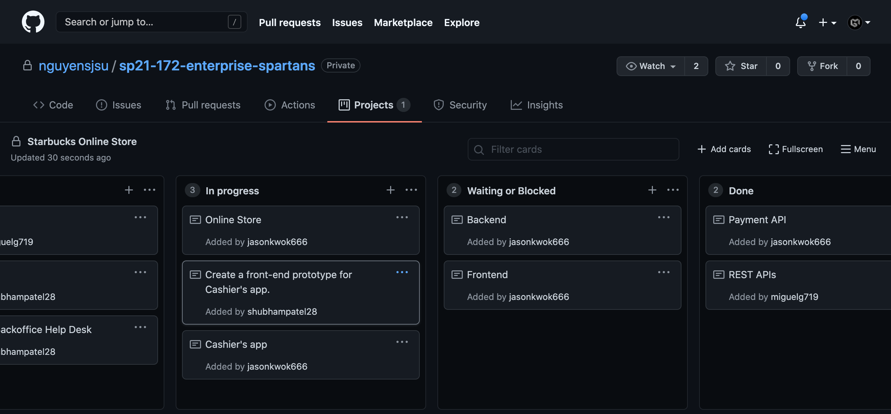
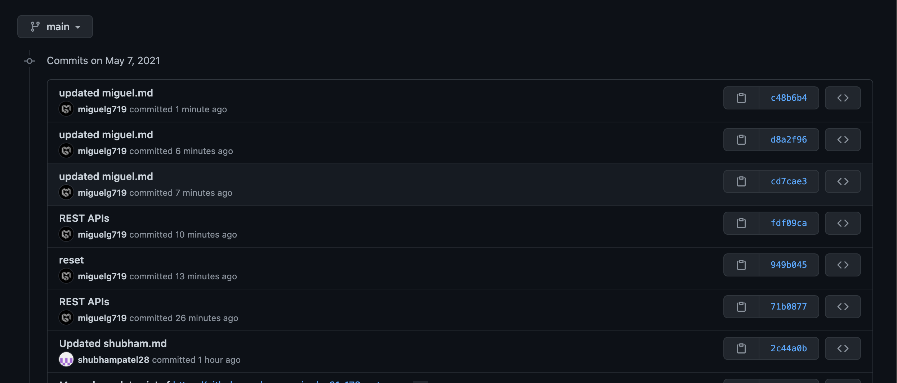
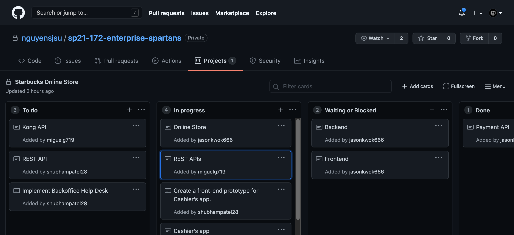

# CMPE 172 Project Journal

## Week 3 and 4

This week I completed the REST API integration, and began including the Kong API as well. We have scheduled a meeting this weekend to finalize the work remaining and select which kinds of tools/frameworks we intend to use.
I also implemented part of the front end for the online store.  

Here is the attached screenshot for the commits this week:

  

## Week 2

This week I worked on integrating the REST APIs to our Starbucks project. I re-used code written for Lab 8 and made all necessary alterations to fit our project. I am not yet completely done but hope to conclude by the end of the week. 

  

## Week 1