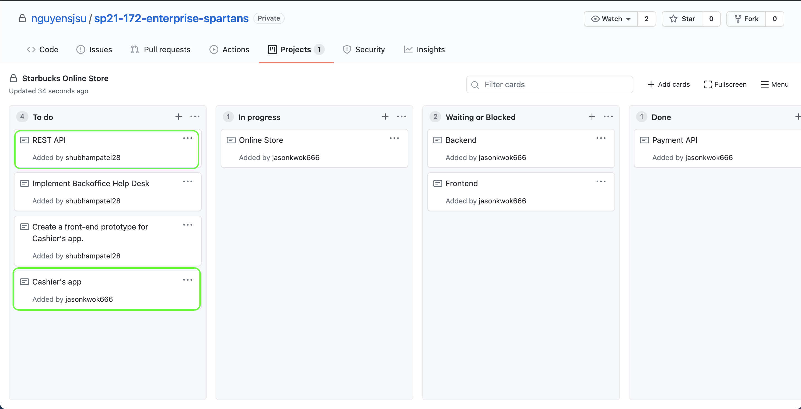
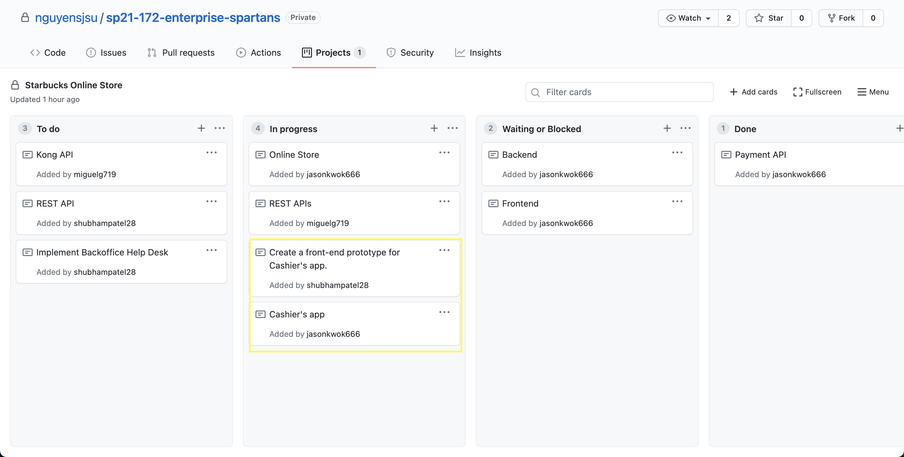

# Individual Project Journal 

## Week 1 

Snapshot of Task Board: 

This week we had a team meeting where we discussed different areas to work. We went over the project requirements and allocated tasks to work on over the next week. I had a few challenges in understanding the different aspects needed for this project. We went over the business requirements for Starbucks project. I set up the cards to track our progress on the GitHub. I also created a project structure on GitHub to keep our files orgranized. I currently re-worked on the starbucks api from the lab 6 and pushed that to Github for reference. Over the next week, I will be working on the implementation of the Cashier's app.

## Week 2 and Week 3

Snapshot of Task Board: 

Over the past two weeks, I had the chance of working on the simple front-end prototype for the cashier's app. I developed a low-fidelity prototype and created a spring project with necessary dependencies, including the spring security. I explored different database to be used for the cashiers app like MongoDB, Reddis, and MySQL. Upon developing the entire project, I navigated resources and tested adding Single Sign-On with Spring Boot & Okta. I had few challenges in setting up the controller and model which I will be working on over the next week. Once this is done, I will be adding Cybersource payments processing that we used in one of the previous labs. 

## Week 4

Over the last week, I was occcupied with my senior design project and EXPO. This did not allow me to progress much on Starbucks project. As a group, we have decided to meet this weekend to collaborate and discuss next steps. I have also blocked time this weekend to finish the frontend and implement the Single Sign-On for the cashiers app. 
